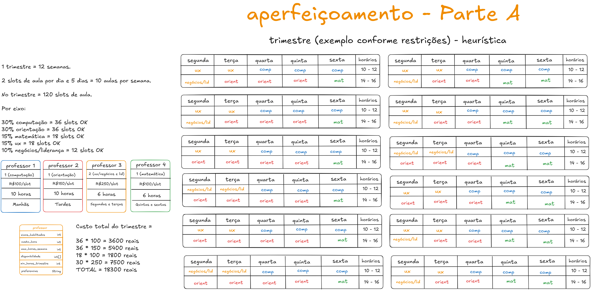
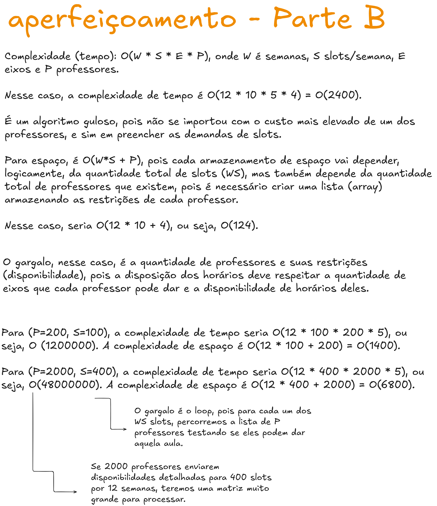
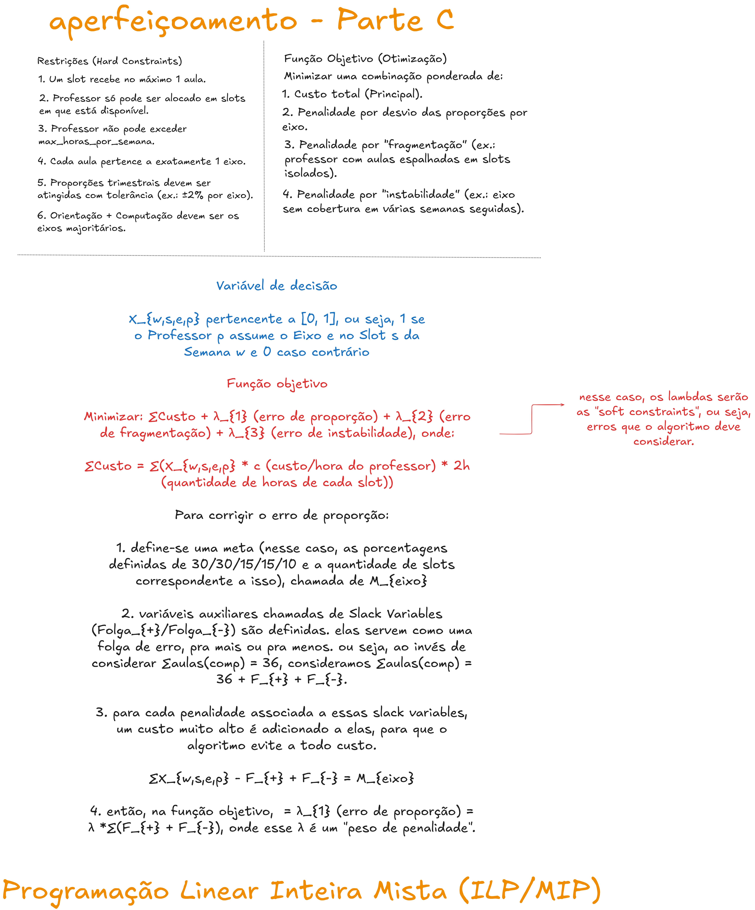

# Aperfeiçoamento - SATA Solver

## 1. Visão Geral

&emsp; O sistema implementa um modelo de otimização para o problema de alocação de aulas ao longo de um trimestre de 12 semanas. A abordagem utilizada é baseada em **Programação Linear Inteira (ILP)**, resolvida com o solver SCIP via OR-Tools.

O objetivo principal é construir uma grade de aulas que:
- respeite restrições operacionais (*hard constraints*);
- atenda metas pedagógicas (*soft constraints*);
- minimize o custo total de alocação de professores.

&emsp; A modelagem segue uma estrutura clássica de decisão binária, onde cada variável indica se uma determinada aula ocorre em um slot específico com um professor específico.


## 2. Modelagem do Problema

&emsp; A modelagem foi inicialmente pensada e construída no Excalidraw. Ela é baseada em quatro dimensões principais:

- semanas ($W$)
- slots por semana ($S$)
- eixos temáticos ($E$)
- professores ($P$)

&emsp; Cada combinação possível entre esses elementos define uma variável de decisão.


### 2.1. Parte A - heurística 

<div align="center">
  <p><b>Figura 01</b> - Solução Heurística</p>
  
</div>

&emsp; Nessa parte, na figura 01, foi construída uma solução que funciona, conforme dados mockados. Nela, coloquei 2 slots de 2h de aula por dia, totalizando 10 slots de aula ou 120 slots por trimestre.

&emsp; Utilizando 4 professores, com seus devidos custos e restrições, seguindo a heurística, achamos um custo de 18300 reais.

&emsp; É válido dizer que esse pensamento inicial é um algoritmo guloso, pois nele me preocupei mais com as soft constraints e com as hard constraints do que com o custo.

### 2.2. Parte B - complexidade e gargalos

<div align="center">
  <p><b>Figura 02</b> - Complexidade</p>
  
</div>

&emsp; Aqui, defini a complexidade da solução e quais gargalos podem estar afetando o algoritmo. Em conclusão, a disponibilidade de tempo e de matérias dos professores é uma grande restrição para esse problema.

### 2.3. Parte C - definição das funções e restrições

<div align="center">
  <p><b>Figura 03</b> - Restrições</p>
  
</div>

Na parte C, foram definidas a variável de decisão e a função objetivo da modelagem, que são mais discutidas na seção `5` e `6` desse documento.

#### Variável principal

```math
x[w][s][e][p] \in \{0,1\}
```
&emsp; Em que 1 significa uma aula alocada em um slot, enquanto 0 significa um slot vazio. Essa estrutura permite representar completamente a grade de aulas ao longo do trimestre.

As restrições são mais desenvolvidas no tópico `4`.

## 3. Estrutura de Dados e Entrada

&emsp; O sistema lê os dados de entrada a partir de um arquivo JSON externo.

**Informações extraídas**:

- número de semanas (`weeks`);

- número de slots por semana (`slots_por_semana`);

- lista de professores;

- custo por hora;

- limites de carga horária;

- disponibilidade e habilitação.

&emsp; Apesar da estrutura do JSON suportar restrições reais, a implementação atual simplifica os dados, para visualizar uma solução mais próxima da heurística construída e a viabilidade do modelo construído inicialmente.

- todos os professores são considerados disponíveis em todos os slots;

- todos os professores são considerados habilitados para todos os eixos.

## 4. Restrições (Hard Constraints)

### Capacidade do Slot

&emsp; Cada slot pode conter no máximo uma aula:

```math
\sum_{e,p} x[w][s][e][p] \leq 1
```

### Disponibilidade

&emsp; A restrição de disponibilidade garante que um professor só pode ser alocado em slots nos quais está disponível.

**Formulação geral:**

```math
\sum_{e} x[w][s][e][p] = 0 \quad \text{se professor } p \text{ não está disponível em } (w,s)
```

**Implementação no código:**

```java
if (!disponivel[w][s][p] || !habilitado[p][e]) {
    solver.makeConstraint(0, 0).setCoefficient(x[w][s][e][p], 1);
}
```

**Comportamento na versão atual:**

&emsp; A disponibilidade é forçada manualmente como verdadeira:

```java
disponivel[w][s][p] = true;
```

- Nenhum slot é bloqueado;

- Todos os professores podem atuar em qualquer horário.


### Carga Horária Máxima

&emsp; Limita a quantidade de horas que cada professor pode lecionar por semana.

**Formulação:**

```math
\sum_{s,e} 2 \cdot x[w][s][e][p] \leq maxHoras[p]
```

- Cada slot equivale a 2 horas

- A soma percorre todos os slots e eixos da semana

**Implementação no código**:

```java
for (int p=0; p<P; p++) 
    for (int w=0; w<W; w++) {
        MPConstraint c = solver.makeConstraint(0, maxHoras[p]);
        for (int s=0; s<S; s++) 
            for (int e=0; e<E; e++) 
                c.setCoefficient(x[w][s][e][p], 2);
    }
```
**Comportamento na versão atual**:

```java
maxHoras[p] = 40;
```
**Consequências**

- Limite suficientemente alto para não restringir o modelo.

- Professores podem assumir praticamente todos os slots disponíveis.

### Habilitação por Eixo

&emsp; Garante que um professor só possa lecionar eixos nos quais está habilitado.

**Formulação:**

$x_{[w][s][e][p]} = 0$ se professor p não é habilitado no eixo e.

**Implementação no código**

```java
if (!habilitado[p][e]) {
    solver.makeConstraint(0, 0).setCoefficient(x[w][s][e][p], 1);
}
```


## 5. Metas Pedagógicas (Soft Constraints)

&emsp; As metas pedagógicas representam a distribuição desejada de aulas entre os diferentes eixos ao longo do trimestre. No modelo atual, essas metas são definidas de forma fixa, correspondendo a uma divisão proporcional previamente estabelecida (30%, 30%, 15%, 15%, 10%).

&emsp; A implementação utiliza variáveis auxiliares (slack) para medir desvios em relação às metas. Para cada eixo, o modelo calcula a diferença entre o número de aulas alocadas e o valor esperado. Caso haja excesso ou falta, esse desvio é capturado por variáveis específicas.

$$\sum_{w,s,p} x_{w,s,e,p} + f_{neg,e} - f_{pos,e} = \text{Meta}_e$$

- $f_{neg,e}$: Representa o déficit de aulas no eixo $e$.
- $f_{pos,e}$: Representa o excesso de aulas no eixo $e$.
- Penalidade: Estas variáveis possuem um custo de $10^9$ na função objetivo, forçando o solver a zerá-las prioritariamente.

&emsp; Esses desvios não tornam o modelo inviável, mas são fortemente penalizados na função objetivo. Isso caracteriza as metas como **soft constraints**, permitindo flexibilidade controlada. Na prática, devido ao peso elevado da penalização, o solver tende a respeitar exatamente os valores definidos.


## 6. Função Objetivo

&emsp; A função objetivo combina dois componentes principais:

1. **Custo financeiro total**
2. **Penalização por desvio das metas pedagógicas**

&emsp; O custo financeiro é calculado com base no valor por hora de cada professor, multiplicado pela duração de cada aula (2 horas). Assim, o modelo busca alocar professores de menor custo sempre que possível.

&emsp; Por outro lado, a penalização associada às metas pedagógicas possui um peso extremamente elevado em relação ao custo. Isso faz com que o solver priorize o cumprimento das metas antes de considerar qualquer otimização financeira.

&emsp; Na prática, isso cria uma hierarquia implícita:
- primeiro: satisfazer metas pedagógicas
- depois: minimizar custo dentro desse espaço viável.

&emsp; O solver busca, então, minimizar $Z$, a soma ponderada dos custos financeiros e penalidades pedagógicas:

$$\min Z = \left( \sum_{w,s,e,p} \text{Custo}_p \cdot 2 \cdot x_{w,s,e,p} \right) + \left( \sum_{e} \text{Peso} \cdot (f_{neg,e} + f_{pos,e}) \right)$$

&emsp; A hierarquia de pesos garante que o cumprimento da grade pedagógica seja soberano em relação à economia de custos.

&emsp; A **Complexidade** é de $O(W \cdot S \cdot E \cdot P)$ variáveis binárias.

## 7. Execução

**Pré-requisitos:**

- Java 17+
- Maven

Certifique-se que você está na raiz do projeto e possui todas as dependências instaladas. Depois, pode rodar no terminal o seguinte comando:

```bash
mvn clean compile exec:java "-Dexec.mainClass=src.main.java.SATASolver"
```

O resultado esperado é algo do gênero:

```bash
SUCESSO: Solucao otima encontrada para o trimestre.
Custo Financeiro Real: R$ 28800,00

=======================================================
          CRONOGRAMA DE AULAS SATA - OTIMIZADO
=======================================================

--- SEMANA 01 ---
Slot | Eixo            | Professor
----------------------------------------
S01  | Orientacao      | Prof 1
S02  | Negocios        | Prof 1
S03  | Orientacao      | Prof 1
S04  | Negocios        | Prof 1
S05  | UX              | Prof 1
S06  | Computacao      | Prof 1
S07  | Computacao      | Prof 1
S08  | Orientacao      | Prof 1
S09  | Orientacao      | Prof 1
S10  | Negocios        | Prof 1

--- SEMANA 02 ---
Slot | Eixo            | Professor
----------------------------------------
S01  | UX              | Prof 1
S02  | Negocios        | Prof 1
S03  | Matematica      | Prof 1
S04  | Orientacao      | Prof 1
S05  | Negocios        | Prof 1
S06  | Orientacao      | Prof 1
S07  | Computacao      | Prof 1
S08  | Computacao      | Prof 1
S09  | Orientacao      | Prof 1
S10  | Computacao      | Prof 1

...

--- SEMANA 12 ---
Slot | Eixo            | Professor
----------------------------------------
S01  | Computacao      | Prof 1
S02  | Computacao      | Prof 1
S03  | Orientacao      | Prof 1
S04  | Computacao      | Prof 1
S05  | Computacao      | Prof 1
S06  | Orientacao      | Prof 1
S07  | Orientacao      | Prof 1
S08  | Computacao      | Prof 1
S09  | Matematica      | Prof 1
S10  | Computacao      | Prof 1
=======================================================
[INFO] ------------------------------------------------------------------------
[INFO] BUILD SUCCESS
[INFO] ------------------------------------------------------------------------
[INFO] Total time:  4.151 s
[INFO] Finished at: 2026-03-18T21:06:51-03:00
[INFO] ------------------------------------------------------------------------
```

## 8. Cenário de Produção 

&emsp; O sistema foi projetado para suportar o ciclo de vida da operação, utilizando três estratégias principais:

### 8.1 Reotimização Incremental

&emsp; Quando ocorre uma mudança pontual (ex: Professor 1 fica doente na Semana 5), não é necessário reconstruir o trimestre do zero. O sistema suporta a Fixação de Variáveis.

&emsp; As variáveis $x_{w,s,e,p}$ das semanas 1 a 4 são travadas em seus valores atuais ($x = 1$ para o que já passou). O solver é executado novamente apenas para o horizonte $w \in [5, 12]$.

&emsp; Isso reduz drasticamente o tempo de processamento, pois o espaço de busca diminui.

### 8.2 Cache de Viabilidade e Pré-processamento

&emsp; Antes de rodar o solver (que é custoso computacionalmente), o sistema realiza uma análise de Densidade de Oferta.

&emsp; O sistema calcula a razão entre a disponibilidade total de horas e a meta pedagógica por eixo.

&emsp; Se a coordenação tentar aumentar a meta de Computação para 50%, o sistema identifica imediatamente se há horas suficientes no banco de dados de professores antes mesmo de iniciar a otimização. Isso evita que o usuário espere por uma solução que o sistema já sabe que é inviável.

### 8.3 Particionamento do Problema

&emsp; Para grandes instituições (ex: 50 professores e 100 turmas), o problema torna-se *NP-Hard*, e o tempo de execução pode crescer exponencialmente.

&emsp; O SATA Solver permite o particionamento por eixos ou por blocos de semanas. Podemos otimizar primeiro os eixos majoritários (Computação e Orientação) e, com esses slots travados, rodar uma segunda passista para os eixos menores. Isso transforma um problema gigante em subproblemas menores, garantindo que a solução seja entregue em segundos, não horas.

## 9. Conclusão

&emsp; O modelo implementado representa uma solução funcional para o problema de alocação de aulas utilizando otimização matemática. A abordagem adotada privilegia viabilidade, estabilidade e aderência às metas pedagógicas. 

&emsp; Porém, simplifica restrições reais, servindo como base para evolução futura do sistema.

